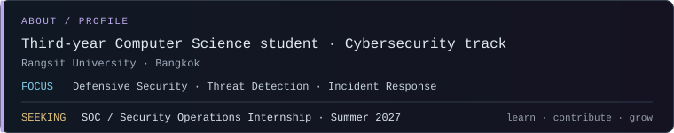
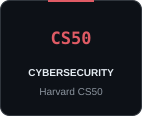
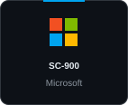

  

## About

## Certifications

### Cybersecurity

  &nbsp;
  &nbsp;
  &nbsp;
  

### Software Engineering

  &nbsp;
  &nbsp;
  &nbsp;
  

## Software Tech Stack

## Cybersecurity Toolkit

## Projects

  
  
  

<a href="https://github.com/Vance1832/virtual-mouse-computer-vision">Virtual Mouse</a> · Python / OpenCV &nbsp; | &nbsp; <a href="https://github.com/Vance1832/Whisper-Of-Ascension">Whisper of Ascension</a> · Unity / C#

## Git Activity

<picture>
  <source media="(prefers-color-scheme: dark)" srcset="https://raw.githubusercontent.com/Vance1832/Vance1832/gh-pages/github-contribution-grid-snake-dark.svg">
  <source media="(prefers-color-scheme: light)" srcset="https://raw.githubusercontent.com/Vance1832/Vance1832/gh-pages/github-contribution-grid-snake.svg">
  
</picture>

## Contact

  
  
  
  
  

Understand how things break. Build them better.

Terminal layout inspired by <a href="https://github.com/a1ohadance">a1ohadance</a> · Artwork customized for my learning journey.

