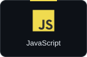
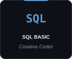
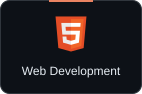

  

  <a href="#about">About</a> ·
  <a href="#blue-team-path">Blue Team Path</a> ·
  <a href="#certifications">Certifications</a> ·
  <a href="#toolbox">Toolbox</a> ·
  <a href="#projects">Projects</a> ·
  <a href="#contact">Contact</a>

<h2 align="center">About</h2>

I'm **Khant Zayar**, a Computer Science student at **Rangsit University**, working toward a **Blue Team / SOC Analyst** role. I practice through TryHackMe labs, study how attacks leave traces, and learn to investigate and respond.

I also build full-stack applications with **Next.js, Django, Python, and SQL**. Software engineering is part of how I learn to understand and secure applications.

<h2 align="center">Blue Team Path</h2>

<code>Foundations → Detection → Incident Response → SOC Analyst</code>

| Learning focus | What I'm working toward |
|:--|:--|
| Foundations | Networking, Linux, Python, and security fundamentals |
| Detection | Log analysis, SIEM fundamentals, and alert triage |
| Incident response | Investigation, containment, recovery, and clear reporting |
| Microsoft security | Exploring Sentinel, Defender, and Entra ID |

  

<h2 align="center">Certifications</h2>

<h3 align="center">Cybersecurity</h3>

  &nbsp;
  &nbsp;
  

<h3 align="center">Software Engineering</h3>

  &nbsp;
  &nbsp;
  &nbsp;
  

Custom display icons · Click a tile to view the issuer's credential.

<h2 align="center">Toolbox</h2>

  
  
  
  

    
  

<h2 align="center">Projects</h2>

| Project | Focus | Built with |
|:--|:--|:--|
| [Enterprise Network Design](https://github.com/Vance1832/enterprise-network-design) | VLAN segmentation, port security, routing, and network services | Cisco Packet Tracer |
| [Flowbit](https://github.com/Vance1832/flowbit) | Wallet, ledger, and settlement workflows | Django · Next.js · PostgreSQL |
| [Rangsit Social](https://github.com/Vance1832/rangsit-social) | Campus community, authentication, feeds, and media | Next.js · MySQL · Cloudinary |
| [TechMobile](https://github.com/Vance1832/techmobile-ecommerce) | Responsive storefront, cart, and checkout demo | HTML · CSS · JavaScript |
| [Virtual Mouse](https://github.com/Vance1832/virtual-mouse-computer-vision) | Gesture-based computer interaction | Python · OpenCV |
| [Whisper of Ascension](https://github.com/Vance1832/Whisper-Of-Ascension) | Third-person mystery game | Unity · C# |

<h2 align="center">Activity</h2>

<picture>
  <source media="(prefers-color-scheme: dark)" srcset="https://raw.githubusercontent.com/Vance1832/Vance1832/output/github-contribution-grid-snake-dark.svg">
  <source media="(prefers-color-scheme: light)" srcset="https://raw.githubusercontent.com/Vance1832/Vance1832/output/github-contribution-grid-snake.svg">
  
</picture>

<h2 align="center">Contact</h2>

  
  
  

<samp>Understand how things break. Build them better.</samp>

Terminal layout inspired by <a href="https://github.com/a1ohadance">a1ohadance</a> · Artwork customized for my learning journey.

